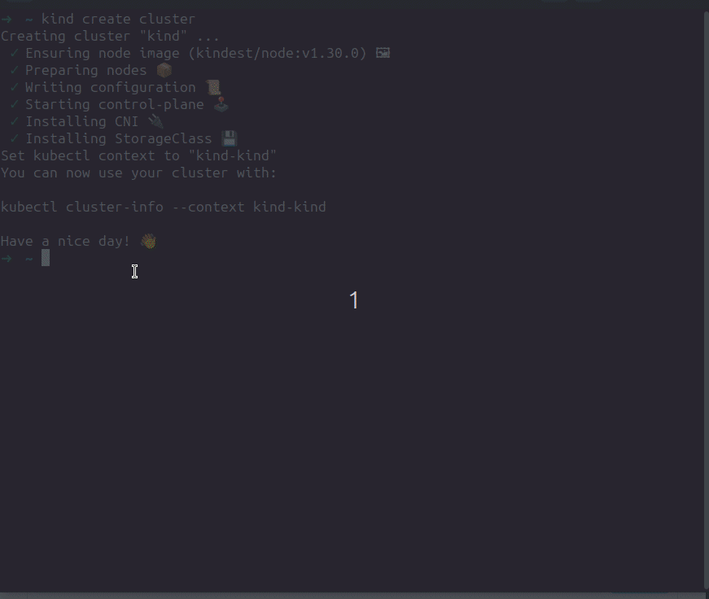

# KubeMedic

[](/LICENSE)
[](https://github.com/robert-cronin/kubemedic/releases/)

KubeMedic is a diagnostic tool for Kubernetes that uses OpenAI's GPT-4o-mini model to help troubleshoot cluster issues. It's still in early development, so use with caution.

## What it does

- Analyzes Kubernetes logs and events
- Suggests fixes for common problems
- Provides a simple web interface


Here's a quick look at KubeMedic in action on a mock scenario involving a misconfigured pod image on [kind](https://kind.sigs.k8s.io/):



## Quick Start

1. Create a secret for your OpenAI API key:

```bash
kubectl create ns kubemedic
kubectl create secret -n kubemedic generic openai-api-key \
    --from-literal=OPENAI_API_KEY=<OPENAI_API_KEY>
```

You can change the secret name and namespace by updating the `openai.secretName` value in the Helm chart.

2. Install KubeMedic:

```bash
helm repo add kubemedic https://robert-cronin.github.io/kubemedic
helm repo update
helm upgrade --install kubemedic kubemedic/kubemedic \
    --namespace kubemedic \
    --create-namespace
```

## Permissions

KubeMedic requires certain permissions to function effectively. Here's an overview of the permissions granted:

- **Read-only access** to most cluster resources for diagnostic purposes
- **List** permissions to Secrets and ConfigMaps (cannot read values)

These permissions allow KubeMedic to gather the necessary information for diagnostics while maintaining security best practices.

### Auditing Permissions

You can review the exact permissions granted to KubeMedic by examining the [rbac.yaml](chart/templates/rbac.yaml) file.

Or to view the current permissions in a running cluster:

```bash
kubectl get clusterrole kubemedic-role -o yaml
```

## Usage

After installing, access the web interface:

```bash
kubectl port-forward service/kubemedic -n kubemedic 5000:5000
```

Then open `http://localhost:5000` in your browser.

## Development

To run KubeMedic locally in dev mode, you can use Tilt. This requires the following tools: 
- [kubectl](https://kubernetes.io/docs/tasks/tools/install-kubectl/)
- [minikube](https://minikube.sigs.k8s.io/docs/)
- [Tilt](https://tilt.dev/); and
- [Docker](https://www.docker.com/) to be installed. 

Once you have those installed, make sure there is an `.env` file at root with a valid `OPENAI_API_KEY=<your_key>` entry and run the following commands:

```bash
minikube start
kubectl config use-context minikube
tilt up
```

Then hit spacebar to open the Tilt UI in your browser and visit KubeMedic at `http://localhost:5000`.

## Requirements

- Kubernetes 1.19+
- Helm 3
- OpenAI API key

## Contributing

Feel free to open issues or PRs if you find bugs or have ideas for improvements.

## License

MIT License. See [LICENSE](LICENSE) file.

---

Initial development by [Robert Cronin](https://github.com/robert-cronin).